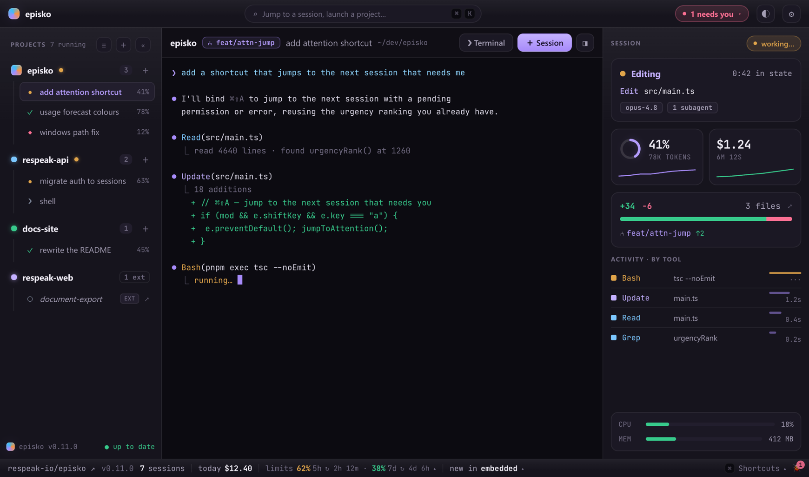
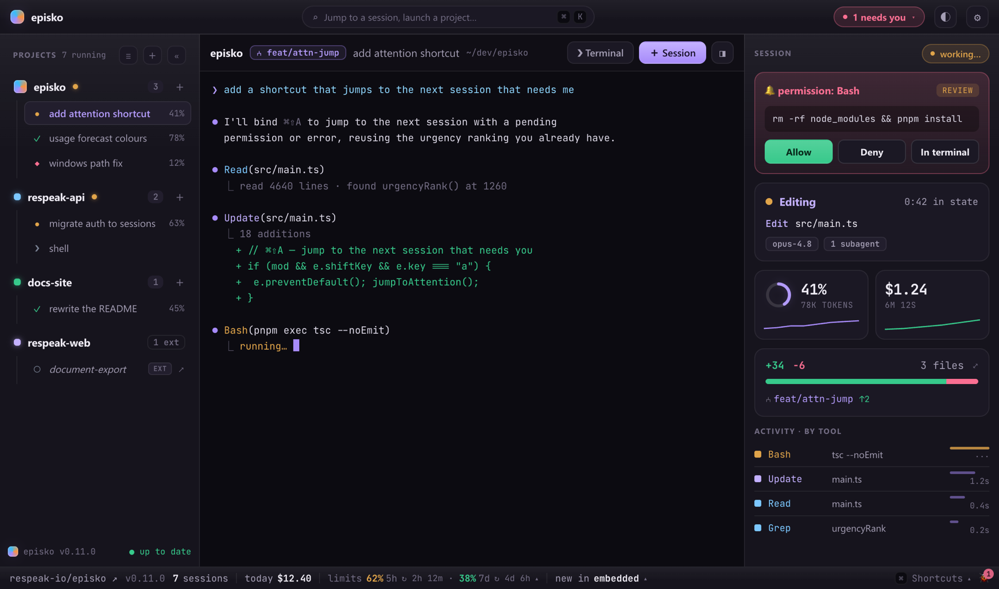
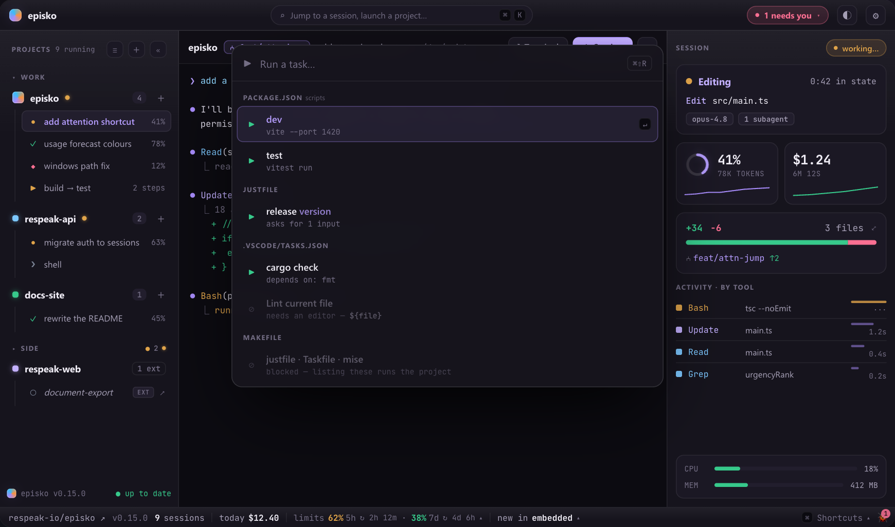
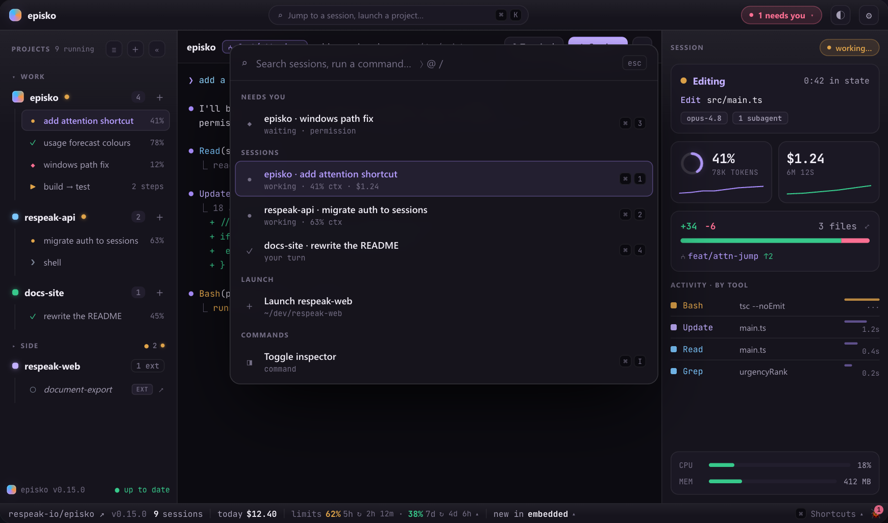
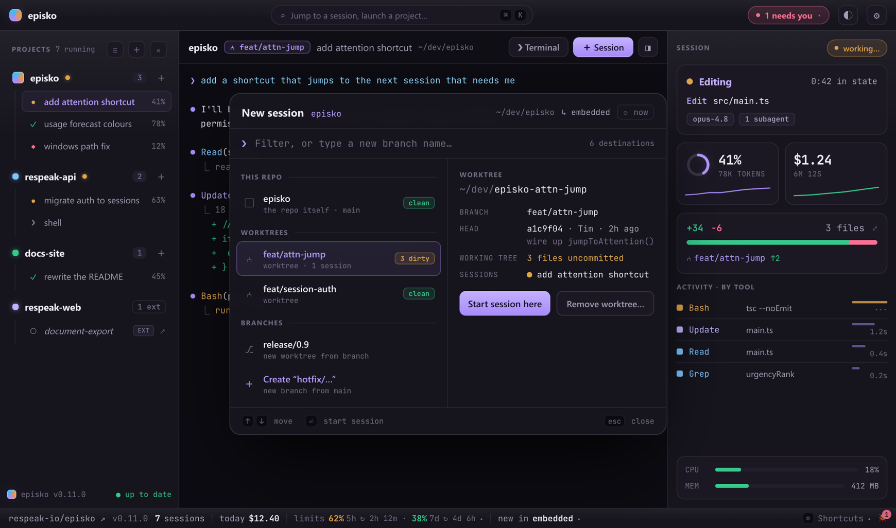
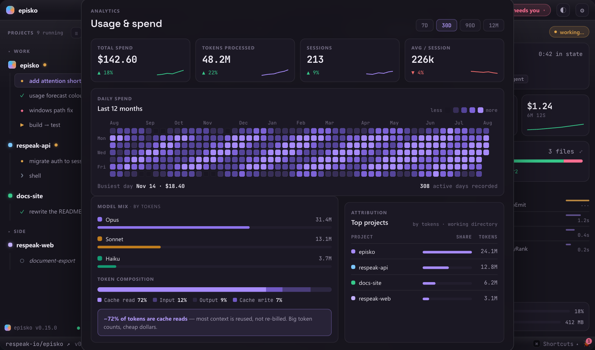

# Episko



**Run a whole flock of [Claude Code](https://claude.com/claude-code) sessions at once.** Episko is a native desktop app that gives every agent its own real terminal and streams back what each one is doing — phase, model, context use, cost, the tool it's running right now — so a dozen agents are as easy to mind as one chat.

**[episko.dev](https://episko.dev)** · [Download](https://github.com/respeak-io/episko/releases/latest) · macOS + Windows · free and open source

> **Status: early, but in daily use.** Episko began as a Phase-0 spike (see [`SPIKE.md`](./SPIKE.md)) proving the two risky pieces — embedding a real terminal and instrumenting Claude Code per launch. It has grown well past that. Expect rough edges and fast-moving internals.

## What it does

- **Every session in one view.** A sidebar of projects and their sessions, each with a status glyph and context %, sorted so whatever needs you floats up. Sessions that need a decision are called out in the header and the tray.
- **Real terminals, not wrappers.** Each session is a genuine PTY running the actual `claude` TUI — type into it, watch it think. Render it embedded ([xterm.js](https://xtermjs.org/)) or hand it to [Ghostty](https://ghostty.org/), Terminal.app or iTerm2. Plain shell panes too, for when you just need a prompt next to an agent.
- **Answer permission prompts in-app.** When Claude asks to run something, Episko surfaces the command with a risk read and lets you allow, deny, or drop into the terminal — instead of hunting for which window is blocked.
- **Live telemetry per session.** Model, context window use, cost, time in state, the running tool, and a short history of recent tool calls with latencies — plus per-session CPU/RAM and a git summary of what's changed.
- **Usage limits, before you hit them.** Your 5-hour and weekly limits with reset times, and a forecast that warms from amber to red when your current pace won't make it.
- **A usage dashboard.** Daily spend as a contribution heatmap, tokens by model, token composition (cache reads vs. input vs. output), and cost attributed per project.
- **Launch into worktrees.** The new-session dialog lists the repo, its worktrees and branches, and can create a worktree on the fly so parallel agents don't fight over one checkout.
- **A commit graph per project.** Right-click a project → *Commit graph…* for its lanes, merges, branch and tag labels. It reads a page at a time and fetches the next as you scroll, so opening it on a huge repo costs the same as on a small one.
- **Sessions started elsewhere show up too.** Claude Code sessions launched outside Episko are discovered and listed read-only, with jump-to-terminal on macOS.
- **Survives a restart.** Episko's launch id *is* Claude's `--session-id`, so resuming replays Claude's own transcript — nothing to capture, nothing to lose.
- **Run the project's own tasks** — VS Code tasks, a `justfile`, package scripts, a Makefile and more, in the same panes, with a run's exit code as its status. [See below](#run-your-projects-tasks-too).
- **Command palette** (`⌘K`), a **settings window** (`⌘,`), per-project accent colours and icons, favourites and drag ordering, a daily cost rollup, and a `caffeinate` toggle so long runs don't sleep.

## Run your project's tasks, too

Agents aren't the only thing worth watching. Episko runs the task definitions your project **already ships** — no new file to write, no editor required — in the same PTY panes it uses for Claude sessions:

`.episko/tasks.toml` · `.vscode/tasks.json` · `.vscode/launch.json` · `package.json` scripts · `justfile` · `Taskfile.yml` · `mise.toml` · `Makefile` · `Cargo.toml`

Hit **▶ Run** in the header (or `⌘⇧R`, or the **Tasks** group in `⌘K`) and pick one. A task run **is** a session: it inherits the phase state machine, sidebar glyphs, attention badge, tray and `⌘1`–`9`, because a run's exit code is simply its phase (0 → done, non-zero → error). Runs are deliberately un-instrumented — no settings file, no telemetry, no cost — and go through a *login* shell so they get the same PATH and version-manager shims your own terminal has. `dependsOn` chains are honoured, and a failed dependency stops the chain — "build then test" must not test a build that didn't happen.

Three rules shaped it:

- **Discovery never executes the project.** `just --dump`, `task --list` and `mise tasks ls` all evaluate what they read, so they sit behind a trust gate; Makefiles are parsed statically because `make -qp` would expand `$(shell …)`. Untrusted providers show one blocked row rather than vanishing.
- **What can't run says so.** A VS Code task needing an editor (`${file}`) is listed greyed with the reason — a missing row reads as "Episko didn't find my task". `launch.json` runs without a debugger, so `attach` and compound configs are blocked rather than silently started as bare processes.
- **Personal preference → `localStorage`; project fact → `.episko/tasks.toml`**, which is the only file Episko writes, edited via `toml_edit` so hand-written comments and ordering survive.

A task inspector offers re-run / pin / stop / **send output to a session** — so a failing build can go straight to an agent. There's a per-project task panel for pinning, hiding and editing, and a prompt for `${input:…}` values and `just` recipe parameters.

## How it works

On each Claude launch Episko writes a throwaway `--settings` file whose `statusLine` command and lifecycle `hooks` POST to a tiny `tiny_http` server bound to an ephemeral localhost port. There is no global `~/.claude` mutation and no transcript-file scraping — instrumentation is per-launch and vanishes with the temp file.

Every POST is tagged with the launch id Episko chose, so telemetry routes to the right pane before any output appears — and keeps routing after `/clear`, `/compact` or `/resume`, each of which makes Claude mint a **new** runtime `session_id`. The permission hook is the one blocking call: the server holds the request open until you answer.

[`CLAUDE.md`](./CLAUDE.md) is the architecture document — the module map for both sides and the invariants that keep it working. [`SPIKE.md`](./SPIKE.md) is the original Phase-0 write-up, kept as a historical record of a single-session prototype; it predates most of the app and is not a reference.

## Stack

- **[Tauri v2](https://tauri.app/)** — Rust backend, system WebView frontend
- **[portable-pty](https://crates.io/crates/portable-pty)** — the PTY (forkpty on macOS, ConPTY on Windows)
- **[tiny_http](https://crates.io/crates/tiny_http)** — the localhost telemetry receiver
- **[xterm.js](https://xtermjs.org/)** — terminal rendering
- Vanilla TypeScript frontend (Vite) — no framework

## Install

Grab the latest build from the [Releases page](https://github.com/respeak-io/episko/releases/latest). You need [Claude Code](https://claude.com/claude-code) installed and on your `PATH`.

### macOS (Apple silicon)

Episko is self-signed but **not notarized through Apple**, so Gatekeeper quarantines the download and refuses to open it (*"… is damaged and can't be opened"*). Clear the quarantine flag **before** opening the `.dmg`:

```sh
xattr -dr com.apple.quarantine ~/Downloads/Episko_*.dmg
```

Then open it, drag **Episko** into Applications, and launch. If it's still blocked on first launch, run the same command on the installed app:

```sh
xattr -dr com.apple.quarantine /Applications/Episko.app
```

### Windows (10 / 11)

Download the `.msi` (or the `.exe` installer) and run it. SmartScreen may warn on first run — choose *More info ▸ Run anyway*.

Episko keeps itself current after install: it checks the latest GitHub release on launch and offers an in-app update. It never installs one behind your back — a restart would kill your running sessions.

## Build from source

### Prerequisites

- [Node.js](https://nodejs.org/) 18+ and [pnpm](https://pnpm.io/)
- [Rust](https://www.rust-lang.org/tools/install) (stable) + the [Tauri system dependencies](https://tauri.app/start/prerequisites/) for your platform
- [Claude Code](https://claude.com/claude-code) on your `PATH`

### Run it

```sh
pnpm install          # first time
pnpm tauri dev        # run the app
pnpm tauri build      # production bundle
```

Then: add a project folder, hit **＋ Session**, accept Claude's workspace-trust prompt the first time in a directory, and ask it something. Watch the sidebar glyph, inspector and footer update live.

Other useful commands:

```sh
pnpm exec tsc --noEmit    # typecheck (strict; this is the real linter)
pnpm test                 # vitest — frontend unit tests
cd src-tauri && cargo test
```

> Run dev builds from a **real terminal**, not from a terminal pane inside Episko — anything started inside Episko becomes its descendant and gets filtered out of the external-session list.

## Platform support

| | macOS | Windows | Linux |
|---|---|---|---|
| Embedded terminal | ✅ | ✅ | — |
| Ghostty / Terminal / iTerm2 | ✅ | — | — |
| Telemetry, permissions, usage | ✅ | ✅ | — |
| External-session discovery | ✅ | ✅ | untested |
| Jump to a session's terminal | ✅ | — | — |

Release builds target Apple silicon (`aarch64`) and Windows x64. Intel Macs aren't covered; Linux isn't packaged, though the non-`ps` paths are written to be OS-agnostic.

## More screenshots

<sub>Renders of the interface with representative data.</sub>

**Answer a permission request without leaving the app** — the command, how risky it looks, and allow / deny / open-in-terminal.



**Run the project's own tasks** — grouped by where they came from. What can't run is listed with the reason rather than hidden.



**Jump anywhere with `⌘K`** — sessions ranked so whatever needs you comes first.



**Start a session on any branch or worktree** — create one on the fly, with a preview of HEAD and what's uncommitted.



**See where the money and tokens went** — daily spend, model mix, token composition, and cost per project.



## License

[MIT](./LICENSE) © Respeak GmbH, Karlsruhe

Episko is an independent project — not affiliated with, endorsed, or sponsored by Anthropic. Claude and Claude Code are trademarks of Anthropic, PBC.
