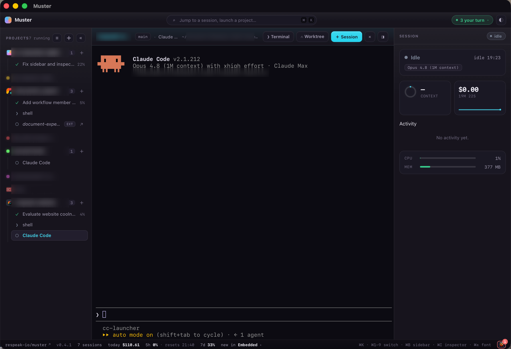

# Episko



A cross-platform desktop app to **launch and manage many [Claude Code](https://claude.com/claude-code) sessions at once** — each in its own embedded terminal, with live status, cost, and context telemetry streamed back to the app.

> **Status: early spike.** Episko grew out of a Phase-0 spike (see [`SPIKE.md`](./SPIKE.md) — a historical record of that spike, not a description of the app today) proving the two risky pieces: embedding a real terminal and instrumenting Claude Code per-launch. It is macOS-first, with a **working embedded-only Windows port**, and is under active development. Expect rough edges.

## What it does

- **Multi-session sidebar** — launch Claude in any of your projects and switch between running sessions. Each session is a real PTY, not a wrapper.
- **Embedded terminals** — full `claude` TUI rendered with [xterm.js](https://xtermjs.org/); optionally hand a session off to [Ghostty](https://ghostty.org/) instead.
- **Live telemetry** — a per-session status pill plus chips for model, context %, cost, and 5h/7d rate-limit usage, driven by Claude Code's hooks + statusLine (no global config mutation, no transcript-file parsing).
- **Git worktree launches** — spin up a session on a fresh worktree/branch of a repo.
- **Tasks & scripts** — runs the task definitions a project already ships (`package.json` scripts, `.vscode/tasks.json`, `justfile`, `Makefile`, `Cargo.toml`, `Taskfile.yml`, `mise.toml`, or Episko's own `.episko/tasks.toml`), with a `▶ Run` picker and `⌘K` entries. A run is just another pane, so it gets the same status glyphs and exit-code handling as a session.
- **Run on stop** — the part a plain terminal can't do: per project, "when an agent finishes a turn here, run this", so every turn becomes a verified turn.
- **Sessions started elsewhere** — Claude sessions running outside Episko show up in the sidebar as read-only mirrors; sessions from previous runs can be resumed.
- **Command palette** (`⌘K`), per-project accent colours and icons, and a persisted daily usage rollup.

## How it works

On each launch, Episko generates a throwaway `--settings` file whose `statusLine` command and `hooks` POST lifecycle events to a tiny localhost HTTP server the app runs. Because it also passes `--session-id`, every event maps back to the right pane before any output appears. No global `~/.claude` mutation, no transcript-file parsing.

[`CLAUDE.md`](./CLAUDE.md) is the current architecture document — the module map for both sides, the constraints that shape them, and the design decisions behind each. [`SPIKE.md`](./SPIKE.md) is the original Phase-0 spike write-up, kept as a historical record; it predates most of the app.

## Stack

- **[Tauri v2](https://tauri.app/)** — Rust backend, system WebView frontend
- **[portable-pty](https://crates.io/crates/portable-pty)** — the PTY (ConPTY on Windows, forkpty on macOS)
- **[tiny_http](https://crates.io/crates/tiny_http)** — the localhost telemetry receiver
- **[xterm.js](https://xtermjs.org/)** — terminal rendering
- Vanilla TypeScript frontend (Vite)

## Install

Releases are built for **macOS (Apple Silicon)** and **Windows (x64)** — see the [Releases page](https://github.com/respeak-io/episko/releases). Both need `claude` on your `PATH`.

### macOS (Apple Silicon)

Download the latest `.dmg`.

Episko is self-signed, **not notarized through Apple**, so macOS Gatekeeper quarantines the download and refuses to open it ("… is damaged and can't be opened"). Clear the quarantine flag from the terminal **before** opening the `.dmg`:

```sh
xattr -dr com.apple.quarantine ~/Downloads/Episko_*.dmg
```

Then open the `.dmg`, drag **Episko** into Applications, and launch it. If the app is still blocked on first launch, run the same command on the installed app:

```sh
xattr -dr com.apple.quarantine /Applications/Episko.app
```

### Windows (x64)

Download `Episko_*_x64-setup.exe` (or the `.msi`) and run it. Episko isn't code-signed, so SmartScreen may warn on first launch — **More info → Run anyway**.

Episko keeps itself up to date after that, on both platforms: it checks the latest GitHub release on launch and offers an in-app update (it never auto-installs — a restart would close your running sessions).

## Build from source

### Prerequisites

- [Node.js](https://nodejs.org/) 18+
- [Rust](https://www.rust-lang.org/tools/install) (stable) + the [Tauri system dependencies](https://tauri.app/start/prerequisites/) for your platform
- [Claude Code](https://claude.com/claude-code) installed and on your `PATH`

### Run it

```sh
pnpm install          # first time
pnpm tauri dev
```

Then in the window: click **+** in the sidebar to add a project folder, hit **＋ Session** (or `⌘K`), accept Claude's workspace-trust prompt in the terminal (first time in a directory), and ask it something. Watch the status pill and chips update live.

## Known limitations

- **Apple Silicon only, on macOS.** Release builds target `aarch64`; Intel Macs aren't covered.
- **Windows is embedded-only.** The PTY, the generated hooks (a PowerShell/`curl.exe` variant of the macOS `/usr/bin/curl` ones) and external-session discovery all work, but the parts written against macOS APIs don't: handing a session off to Ghostty/Terminal.app/iTerm2, jumping to an external session's terminal window, and the per-session CPU/RAM bars, which shell out to `ps`.
- **Windows: statusLine telemetry may not arrive.** Observed on v0.10.1 — hooks routed normally but the statusLine half (model, context %, cost, duration, rate-limit meters) stayed empty, and it was isolated as far as Claude Code not invoking the command. Not yet re-checked on the current build.
- **Linux is unported.** The non-`ps`, non-`osascript` paths are written to be OS-agnostic, but nothing has been built or run there.

## License

[MIT](./LICENSE) © Respeak
